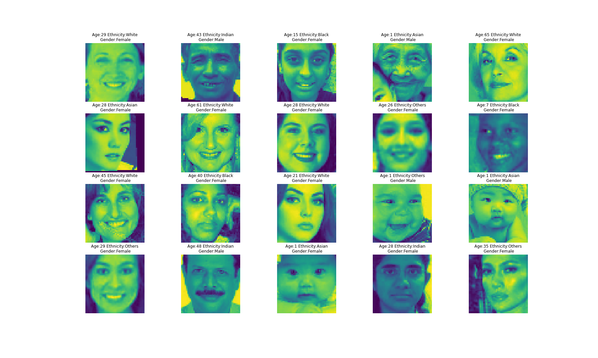
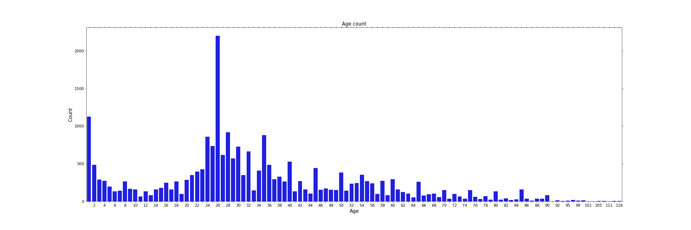
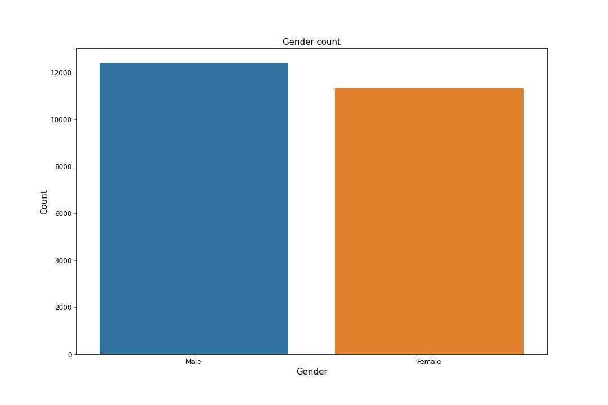
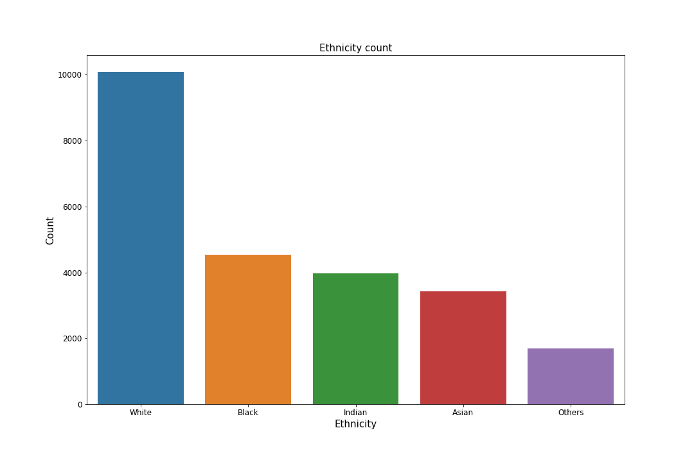
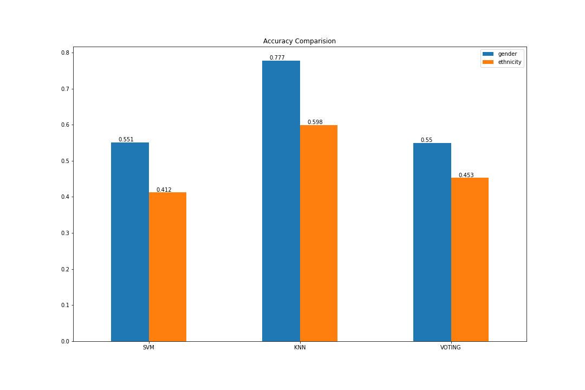

# Age Gender Prediction 

## Python Modules 
* Pandas
* Numpy
* Tensorflow
* Scikit Learn
* Seaborn
* Matplotlib

## Data  
Images were acquired from [UTKFace dataset](https://susanqq.github.io/UTKFace/). Dataset contains around 27,000 images of people with different gender, ethnicity (race) and age. Data has been aready preprocesed into cvs format and this project starts from investigating the preprocessed data. Each image is already reshaped 48 by 48 pixels size. 

## Exploratory Data Analysis
There are 3 different targets to classify for this dataset, which are described below. 

### Age Distribution
Dataset has long age span ranging from 0 to 116. DIstribution is demostrated below. 

### Gender Distribution
Number of male individuals is little higher female, however difference can be neglected for this analysis. Also it should be noted that in original data Female category is mapped as 1, and Male as 0. Some simple changes were done using pandas mapping feature. 

### Ethnicity Distribution
Ethnicity category is mapped as an integer from 0 to 4, denoting  White, Black, Asian, Indian, and Others (like Hispanic, Latino, Middle Eastern) respectively. 

## Non Deep Learning Models

### PCA Decomposition

### Comparison of Classification Models

## Deep Learning Models

### Gender Prediction Model

### Ethnicity Prediction Model

### Age Prediction Model