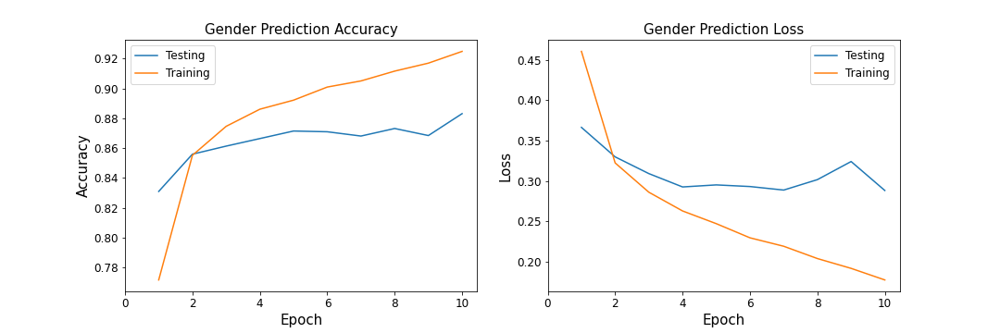
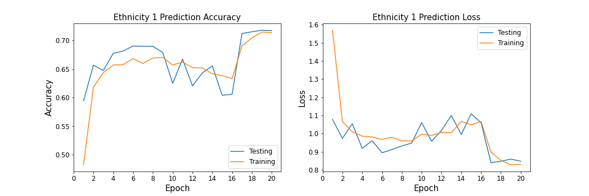
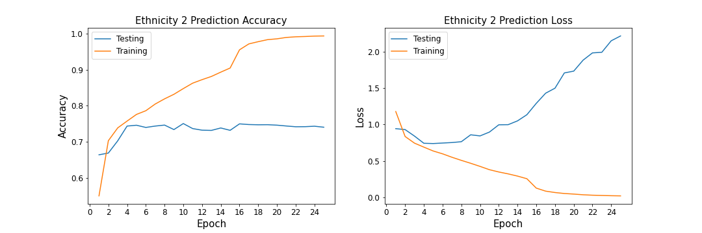

# Age Gender Prediction 

## Python Modules 
* Pandas
* Numpy
* Tensorflow
* Scikit Learn
* Seaborn
* Matplotlib

## Data  
Images were acquired from [UTKFace dataset](https://susanqq.github.io/UTKFace/). Dataset contains around 27,000 images of people with different gender, ethnicity (race) and age. Data has been aready preprocesed into cvs format and this project starts from investigating the preprocessed data. Each image is already reshaped 48 by 48 pixels size. 

## Exploratory Data Analysis
There are 3 different targets to classify for this dataset, which are described below. 

### Age Distribution
Dataset has long age span ranging from 0 to 116. DIstribution is demostrated below. 

### Gender Distribution
Number of male individuals is little higher female, however difference can be neglected for this analysis. Also it should be noted that in original data Female category is mapped as 1, and Male as 0. Some simple changes were done using pandas mapping feature. 

### Ethnicity Distribution
Ethnicity category is mapped as an integer from 0 to 4, denoting  White, Black, Asian, Indian, and Others (like Hispanic, Latino, Middle Eastern) respectively. 

## Non Deep Learning Models

### PCA Decomposition

### Comparison of Classification Models

## Deep Learning Models

### Gender CNN Prediction Model
1. Input data is passed through 4 Convolution Layers with Max Pooling between each
2. Data is flattened
3. Flattened data is passed through 2 dense layers
4. Model is compiled with adam optimizer and binary crossentropy loss function

After 10 epochs accuracy of model is around 90%, which is higher than for non-deep learning models.

### Ethnicity Prediction Model
Two different models have been used for ethnicity predictions
1. Input data is passed through 5 Convolution Layers with 3 Max Pooling between 
2. Data is  flattened
3. Flattened data is passed through 2 dense layers
4. Model is compiled with rmsprop optimizer and sparse categorical crossentropy loss function

After 20 epochs accuracy of model is around 70%, which is higher than for non-deep learning models.

1. Input data is passed through 4 Convolution Layers with Max Pooling between 
2. Data is  flattened
3. Flattened data is passed through 2 dense layers
4. Model is compiled with adam optimizer and sparse categorical crossentropy loss function

It appears that model with less parameters performed better and test accuracy is arround 75%. 

### Age Prediction Model