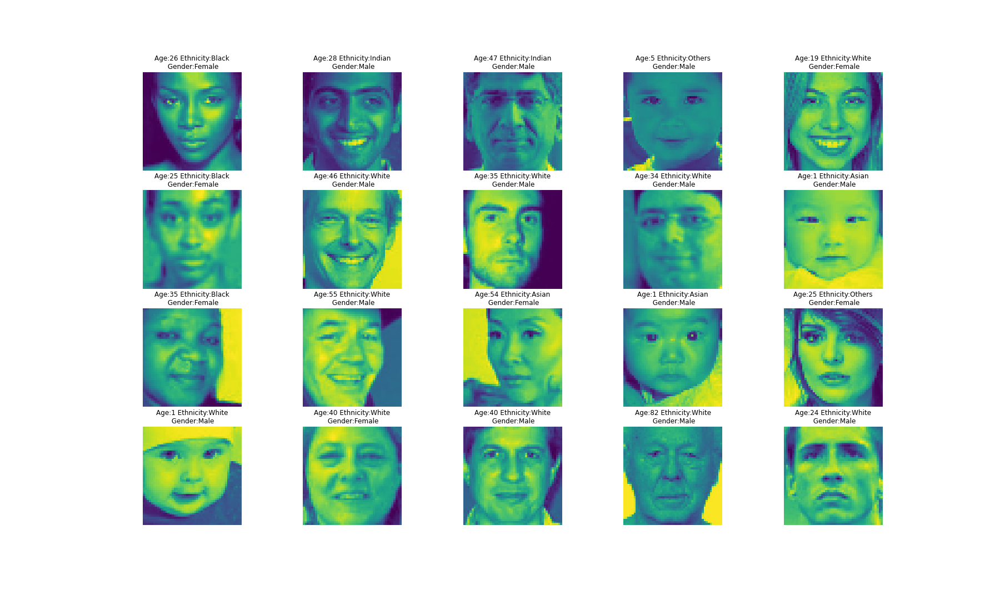

# Age Gender Prediction 

## Python Modules 
* Pandas
* Numpy
* Tensorflow
* Seaborn
* Matplotlib

## Data  
Images were acquired from [UTKFace dataset](https://susanqq.github.io/UTKFace/). Dataset contains around 27,000 images of people with different gender, ethnicity (race) and age. Data has been aready preprocesed into cvs format and this project starts from investigating the preprocessed data. Each image is already reshaped 48 by 48 pixels size. 

## Exploratory Data Analysis
There are 3 different targets to classify for this dataset, which are described below. 

### Age Distribution

### Gender Distribution

### Ethnicity Distribution
